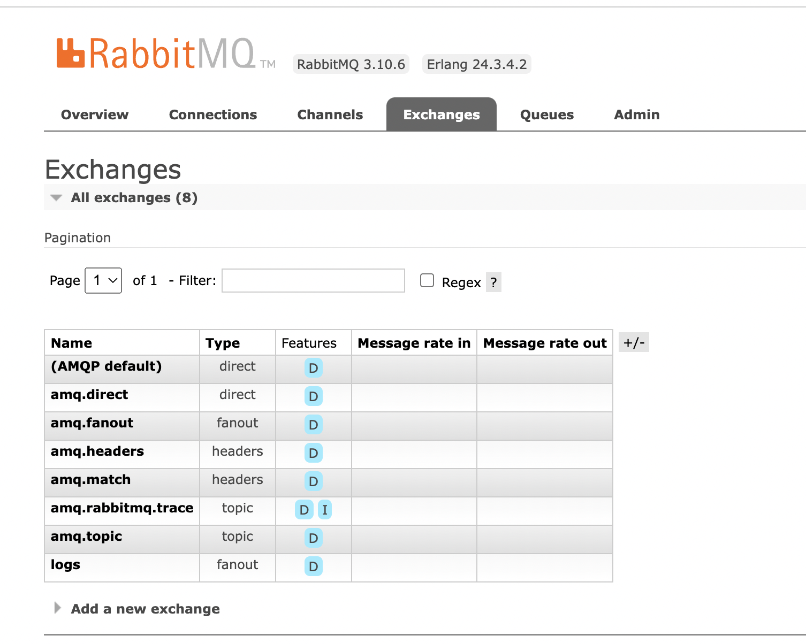
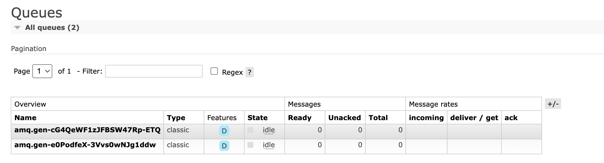
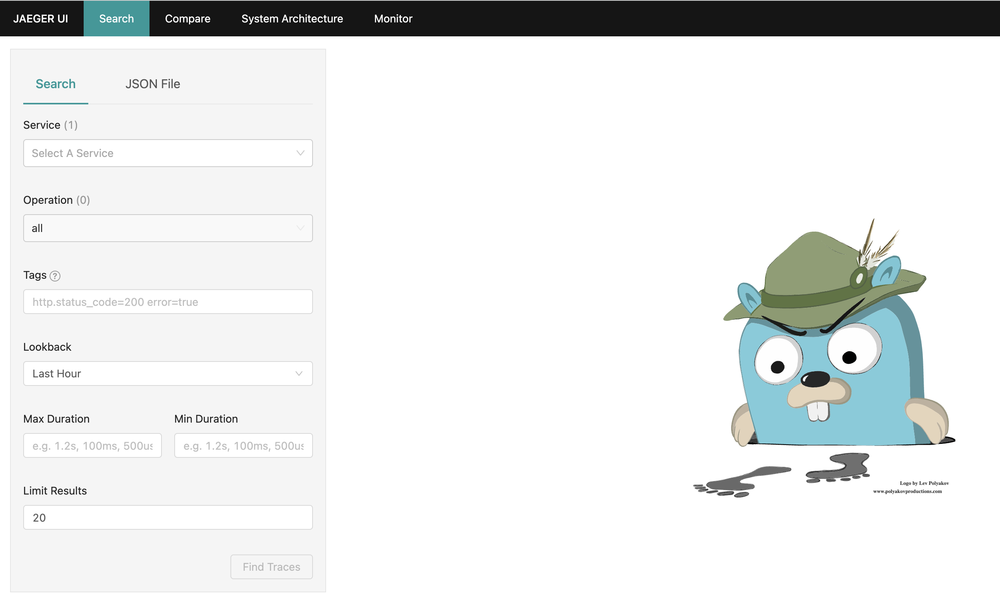
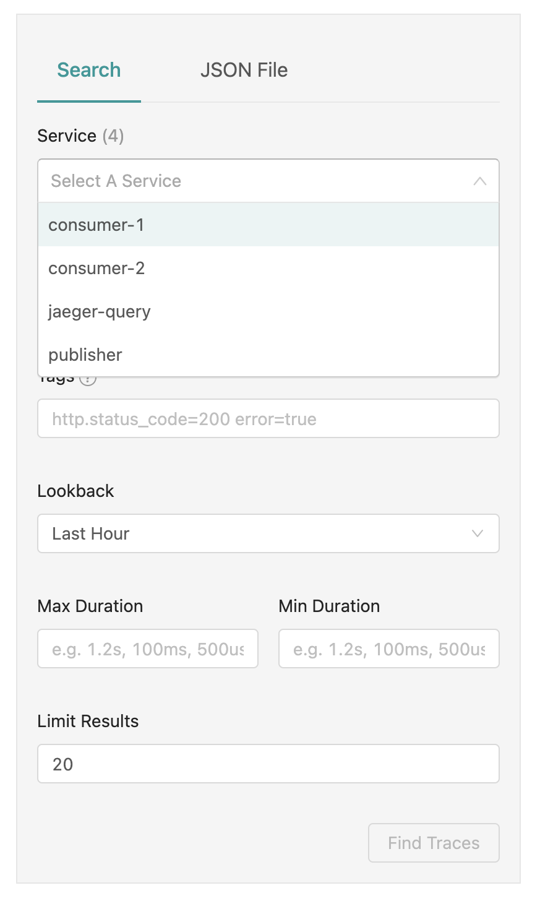
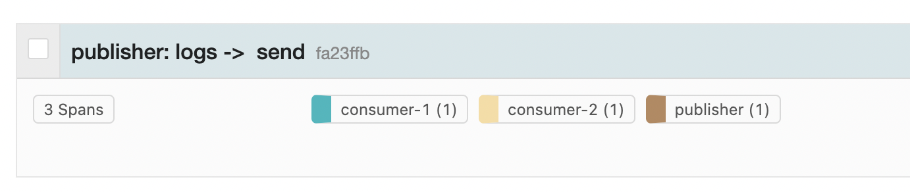
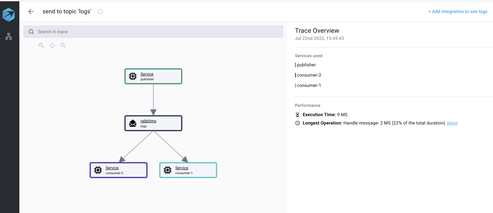

# RabbitMq OpenTelemetry node example

In this guide, we will demonstrate how to use OpenTelemetry in Node to create spans for different RabbitMq operations. (e.g., consume and produce). In addition, we will show you how to visualize your traces. Also covered will be RabbitMq, OpenTelemetry, distributed tracing, and how they interact.

Feel free to skip straight to the [practical section](#tutorial) of this guide if you are already familiar with RabbitMq and OpenTelemetry.

## What to expect

- [What is OpenTelemetry?](#what-is-opentelemetry)
- [What is RabbitMq?](#what-is-rabbitmq)
- [Implenting all the how to's](#tutorial)
  - [Create application.](#step-1---create-application)
  - [Add RabbitMq messaging code.](#Step-2---Add-RabbitMq-messaging-code)
  - [Add Opentelemetry tracing](#Step-3---Add-Opentelemetry-Tracing)
  - [Visualize tracing](#Step-4---Visualize-tracing)

## What is OpenTelemetry

The OpenTelemetry project provides APIs and SDKs as an open-source project. It's led by the CNCF (Cloud Native Computing Foundation, the same organization responsible for Kubernetes), and it collects, exports, and generates metrics, traces, and logs (which make up the three pillars of observability).

There is a great deal of complexity in modern software applications. Their architecture is made up of many microservices that are independent of one another. For communication and information transfer, these microservices use messaging systems (like RabbitMq).

Having a good understanding of where each message has gone, why it went there, and when it went there is critical.

Distributed architectures are complex, which is why users need an easy way to visualize and troubleshoot them.

We use OpenTelemetry to collect data from different transactions within our services and components. Third-party tools, such as messaging systems like RabbitMq, are also included in those components. Using the collected data, we can gain a better understanding of how our software performs and behaves.

The OpenTelemetry library captures all data under one specification. The data is then shipped to any dedicated location (e.g., the backend, the collector, or any open source that supports it, and more).

Check out this [short guide](https://www.aspecto.io/blog/what-is-opentelemetry-the-infinitive-guide/) for a deeper dive into OpenTelemetry.

As far as this OpenTelemetry js guide is concerned, these terms should be familiar to you:

- Span: Spans represent actions/operations that have occurred in our system. An HTTP request or a database operation that spans over time (starts at X and has a duration of Y milliseconds). A span would usually be the parent and/or the child of another span.

- Trace: Traces represent a tree of spans connected in a child/parent relationship. Traces specify the progression of requests across different services and components in our app (DB, data sources, queues, etc.). For example, sending an API call to user-service resulted in a DB query to users-db.

- Exporter: Having created a span, we need to send it to a dedicated backend. The output may be in memory, through Jaeger Tracing, or even at the console. It is the exporter's responsibility to send the data to our backend.

- Instrumentation - The instrumentation libraries enable us to gather data and generate spans based on different libraries used in our applications, such as RabbitMQ, Mongo, Express, etc. Our app can be instrumented manually or automatically.

  - Auto Instrumentation - Automatically create spans from the application libraries we use with ready-to-use OpenTelemetry libraries.
  - Manual instrumentation - Writing specific code manually to define where each span begin and ends.

See the [official documentation](https://opentelemetry.io/docs/concepts/data-sources/) for more information on OpenTelemetry jargon.

## What is RabbitMq

RabbitMq is an open source message broker.

A message broker is a program that transfers information between services. The information is packaged in an object we call a 'message'. The Message Broker transfers this message in a way that it will be understood by each service.
RabbitMq supports a variety of messaging patterns.

The most famous of which is the publisher/subscriber pattern. In this pattern, one or more services produce and send messages (publishers), while other services consume them (subscribers). It is possible for any service to subscribe to receive messages from any publisher.

Another common pattern is the workers pattern. The message pattern represents a system in which one service sends commands to multiple services. This will allow all the resources of the system to be better utilized by dividing work units among several workers.

In our guide we will use the publisher/subscriber pattern.

For more information visit the [official site](https://www.rabbitmq.com/)

## Tutorial

1. [Create application.](#step-1---create-application)
2. [Add RabbitMq messaging code.](#Step-2---Add-RabbitMq-messaging-code)
3. [Add Opentelemetry tracing](#Step-3---Add-Opentelemetry-Tracing)
4. [Visualize tracing](#Step-4---Visualize-tracing)

### Step 1 - Create application

First lets create a basic node application. It will be comprised of two services. a publisher and subscribers. The publisher wil listen to requests from the user. After reciveing such request it will publish a message to a topic (called exchange in RabbitMq terms). The services that will subscribe to this exchange will recive and print the message.

The publisher code:

```javascript
/* publisher.js */

const express = require('express')
const app = express()
const port = 3000

app.get('/', (req, res) => {
  // TODO: Implenet publish message
  res.send('Hello World!')
})

app.listen(port, () => {
  console.log(`Example app listening on port ${port}`)
})

/* consumer.js */

const express = require('express')
const app = express()
const port = 3001

app.listen(port, () => {
  // TODO: implenet consume messages
  console.log(`Example app listening on port ${port}`)
})
```

### Step 2 - Add RabbitMq messaging code

Now lets add the code we need to publish and consume messages on RabbitMq. for that we will need to install the amqplib library and run a local instance of RabbitMq.

```bash
npm i amqplib

docker run -d --name rabbit rabbitmq:3-management
```

Now lets add the code our publisher:

```javascript
/* publisher.js */

const amqplib = require('amqplib');
const express = require('express')
const app = express()
const port = process.env.PORT || 3000

let rabbitConnection;
// An exchange is where the rabbitMq computation takes place. the messages are sent to an exchange. The exchange then distributes the messages to consumer according to a messaging strategy defined by the exchange type
let exchange = 'logs'
const sendRabbitMqMessage = async (message) => {
  if (!rabbitConnection) {
    rabbitConnection = await amqplib.connect('amqp://localhost');
  }
  
  const channel = await rabbitConnection.createChannel();
  // Exchange of type fanout means sends the message from this exchange to all consumers that subscribed to the exchange.
  await channel.assertExchange(exchange , 'fanout')

  // Notice that we pass an empty string as the queue name. this means the queus will define per consumer.
  await channel.publish(exchange, '', Buffer.from(message))
}

app.get('/', (req, res) => {
  const message = 'Hello World!'
  console.log(`Send message: '${message}'`);
  sendRabbitMqMessage(message);
  res.send(message)
})

app.listen(port, () => {
  console.log(`Publisher listening on port ${port}`)
})
```

Now lets subscribe to messages by adding this code to the consumer:

```javascript
/* consumer.js */

const amqplib = require('amqplib');
const express = require('express')
const app = express()
const port = process.env.PORT || 3001

let rabbitConnection;
let exchange = 'logs'

const rabbitMqListenToMessages = async (callback) => {
    if (!rabbitConnection) {
        rabbitConnection = await amqplib.connect('amqp://localhost');
    }
    const channel = await rabbitConnection.createChannel();
    await channel.assertExchange(exchange, 'fanout')
    // By passing an empty string we generate a random queue for the consumer to recieve messages on.
    const q = await channel.assertQueue('');
    // we then bind this queue to the exchange so that every message recieved by the exchanged will be pushed upon the queue and be read by the consumer
    await channel.bindQueue(q.queue, exchange, '');
    // Here we consume all the messages from the unnamed queue we created. Note we are passing the no acknowledge flag. this lets the broker know that it should'nt wait for the consumer to acknowledge that it had recieved the message.
    await channel.consume('', (message) => callback(message.content.toString()), { noAck: true })
}

app.listen(port, () => {
    rabbitMqListenToMessages((message) => console.log(`Consumer recieved message: ${message}`))
    console.log(`Consumer listening on port ${port}`)
})

```

Lets check our messaging works properly.
Run the application:

```bash
# terminal 1
node ./publisher.js
> Publisher listening on port 3000

# terminal 2
node ./consumer.js
> Consumer listening on port 3001

# We can also add another consumer just for fun
# terminal 2.1
PORT=3002 node ./consumer.js
> Consumer listening on port 3002
```

After running the services we can open rabbitmq management ui at [http://localhost:15672/#/exchanges](http://localhost:15672/#/exchanges) (username and password are both 'guest')
There we can see the exchange named 'logs' of type fanout we created:


By navigating to queus tab we can see the two queue that were created for the consumer services:


Now let call the get endpoint and trigger the flow of events:

```bash
# terminal 3
curl http://localhost:3000
```

Now we should see the following printed:

```bash
# on terminal 1
> Send message: 'Hello World!'

# on terminal 2 and 2.1
> Consumer recieved message: Hello World!
```

Congrats we just wrote a system with services that can communicate with each other!
The next step is to understand the flow of the system by adding traces.

### Step 3 - Add Opentelemetry Tracing

So far so good. We can now start examinig our application behavior. For that we will collect our tracing using amqplib instrumentation. Then we will view this tracing using ConsoleSpanExporter, this means the traces will be printed to console.

Install the following packages:

```bash
npm install @opentelemetry/sdk-node @opentelemetry/instrumentation-amqplib
```

Create a tracing.js file:

```javascript
/* tracing.js */

// Require dependencies
const opentelemetry = require("@opentelemetry/sdk-node");
const { AmqplibInstrumentation } = require('@opentelemetry/instrumentation-amqplib');

const sdk = new opentelemetry.NodeSDK({
  traceExporter: new opentelemetry.tracing.ConsoleSpanExporter(),
  instrumentations: [new AmqplibInstrumentation()]
});

sdk.start()
```

by running the application again and invoking the endpoint we can see the traces printed on console:

```bash
# terminal 1
node --require './tracing.js' ./publisher.js

# terminal 2
node --require './tracing.js' ./consumer.js

# terminal 3
curl http://localhost:3000

# terminal 1 prints
> {
  traceId: '12b2821161bd10eab55c1b8cd6186c05',
  parentId: undefined,
  name: 'logs ->  send',
  id: '1c735c730620e8d6',
  kind: 3,
  timestamp: 1658405256989983,
  duration: 1603,
  attributes: {
    'messaging.protocol_version': '0.9.1',
    'messaging.url': 'amqp://localhost',
    'messaging.protocol': 'AMQP',
    'net.peer.name': 'localhost',
    'net.peer.port': 5672,
    'messaging.system': 'rabbitmq',
    'messaging.destination': 'logs',
    'messaging.destination_kind': 'topic',
    'messaging.rabbitmq.routing_key': ''
  },
  status: { code: 0 },
  events: [],
  links: []
}

# terminal 2 prints
{
  traceId: '12b2821161bd10eab55c1b8cd6186c05',
  parentId: '1c735c730620e8d6',
  name: ' process',
  id: '3fa968300c72206d',
  kind: 4,
  timestamp: 1658405256995217,
  duration: 101898035,
  attributes: {
    'messaging.protocol_version': '0.9.1',
    'messaging.url': 'amqp://localhost',
    'messaging.protocol': 'AMQP',
    'net.peer.name': 'localhost',
    'net.peer.port': 5672,
    'messaging.system': 'rabbitmq',
    'messaging.destination': 'logs',
    'messaging.destination_kind': 'topic',
    'messaging.rabbitmq.routing_key': '',
    'messaging.operation': 'process'
  },
  status: {
    code: 2,
    message: 'instrumentation timeout called on message with requeue'
  },
  events: [],
  links: []
}
```

Wow What just happend! Look at all this information we have now. Lets examine it a little. First notice that we triggered two spans. One for sending the message and one for recieving it. The two spans are united under the same trace and you can see that because they both have the same traceId. We can also see that the span printed by the consumer points with its parentId to the one printed by the publisher thus provide us an insight to the flow of the app.

### Step 4 - Visualize tracing

Well done! All we have left is to export these traces to a platform where we can view and analyze the behaviour of the application.
To do that we will use Jaeger.
Jaeger is an open source project that provides an end-to-end distributed tracing capabilities. You can read about it more in the [following article](https://www.aspecto.io/blog/jaeger-tracing-the-ultimate-guide/).

First lets run a local instance of Jaeger:

```bash
docker run -d --name jaeger \
  -e COLLECTOR_OTLP_ENABLED=true \
  -p 5775:5775/udp \
  -p 6831:6831/udp \
  -p 6832:6832/udp \
  -p 5778:5778 \
  -p 16686:16686 \
  -p 14250:14250 \
  -p 14268:14268 \
  -p 14269:14269 \
  -p 9411:9411 \
  jaegertracing/all-in-one:1.30
```

We can view the platforms ui by visiting [http://localhost:16686](http://localhost:16686).


As we can see, there are no traces to view yet. To see traces we need to add an Exporter to export our traces to Jaeger.

We first need to install the following packages:

```bash
npm install @opentelemetry/exporter-jaeger @opentelemetry/sdk-trace-base
```

Now Lets edit our tracing.js file and add Jaeger exporter:

```javascript
/* tracing.js */

const opentelemetry = require("@opentelemetry/sdk-node");
const { AmqplibInstrumentation } = require('@opentelemetry/instrumentation-amqplib');
const { SimpleSpanProcessor } = require("@opentelemetry/sdk-trace-base");
const { JaegerExporter } = require('@opentelemetry/exporter-jaeger');

const options = {
  tags: [], // optional
  // You can use the default UDPSender
  host: 'localhost', // optional
  port: 6832, // optional
  // OR you can use the HTTPSender as follows
  // endpoint: 'http://localhost:14268/api/traces',
  maxPacketSize: 65000 // optional
}
const exporter = new JaegerExporter(options);

const sdk = new opentelemetry.NodeSDK({
  spanProcessor: new SimpleSpanProcessor(exporter),
  instrumentations: [new AmqplibInstrumentation()],
  serviceName: process.env.SERVICE
});

sdk.start()
```

Note that we added service name to the OpenTelemetry configuration. This will help us ditinguish betwin all the node process running around.

Now lets run the publisher and consumers services:

```bash
# terminal 1 - publisher
SERVICE=publisher node -r './tracing.js' publisher.js
> Publisher listening on port 3000

# terminal 2 - consumer 1
SERVICE=consumer-1 node -r './tracing.js' ./consumer.js
> Consumer listening on port 3001

# termianl 3 - consumer 2
SERVICE=consumer-2 PORT=3002 node -r './tracing.js' consumer.js
> Consumer listening on port 3002
```

Invoke the publisher's endpoint:

```bash
# terminal 4
curl http://localhost:3000
```

Lets see our traces in Jaeger UI:

As you can see we now have 3 more services listed in the search input:


By selecting the publisher service and clicking 'Find Traces' we can 1 Trace with 3 spans created from 3 different services:



Clicking on the trace once more will show us the details if the span (depth, total spans) and details about each span:


Thats it we are done. We can clearly see the flow of the application and examine information send and recieved from each of our services.

We can try a different visualization by changing our exporter to Aspecto exporter:

Lets edit our tracing.js file and add Aspecto exporter. note that for that you will need to get an Aspecto api key. You can get it by creating a [`free acount`](https://www.aspecto.io/pricing/)

Install the following packages:

```bash
npm install @opentelemetry/sdk-trace-base @opentelemetry/exporter-collector
```

Edit tracing.js and add the new exporter.

```javascript
/* tracing.js */

// Require dependencies
const opentelemetry = require("@opentelemetry/sdk-node");
const { AmqplibInstrumentation } = require('@opentelemetry/instrumentation-amqplib');

const { SimpleSpanProcessor } = require("@opentelemetry/sdk-trace-base");
const { CollectorTraceExporter } = require('@opentelemetry/exporter-collector');

const exporter = new CollectorTraceExporter({
  url: 'https://otelcol.aspecto.io/v1/trace',
  headers: {
    // Aspecto API-Key is required
    Authorization: process.env.ASPECTO_API_KEY
  }
})

const sdk = new opentelemetry.NodeSDK({
  spanProcessor: new SimpleSpanProcessor(exporter),
  instrumentations: [new AmqplibInstrumentation()]
  serviceName: process.env.SERVICE
});

sdk.start()
```

Thats it!. Now by running the application and invoking the endpoint once again:

```bash
# terminal 1 - publisher
SERVICE=publisher node -r './tracing.js' publisher.js
> Publisher listening on port 3000

# terminal 2 - consumer 1
SERVICE=consumer-1 node -r './tracing.js' ./consumer.js
> Consumer listening on port 3001

# termianl 3 - consumer 2
SERVICE=consumer-2 PORT=3002 node -r './tracing.js' consumer.js
> Consumer listening on port 3002
```

Invoke the publisher's endpoint:

```bash
# terminal 4
curl http://localhost:3000
```

We can view our tracing in the Aspecto platform. Just login to your account and view the recent traces. Aspecto visualize the tracing as a graph which makes it super convient to understand the application's flow.



### Final notes

Aspecto provides a simple way for wrapping all the instrumentations your node application needs with the Aspecto SDK. Simply import and invoke the following package at the beginig of you code (before all other imports)

```javascript
require('@aspecto/opentelemetry')({
  aspectoAuth: process.env.ASPECTO_API_KEY
});
```

## License

[MIT](https://choosealicense.com/licenses/mit/)
